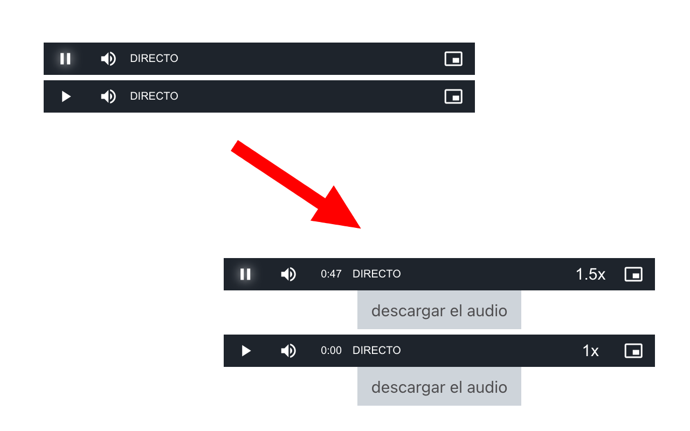

# Chrome Extension : Player Universidad Nacional de Quilmes

Extension para simplificar la utilización del intranet de Unqui

This extension changes the audio player to add speed options, also add a download button.
The purpose of this extension is to add some usefull options to the audio player proposed by the university campus. It add the current time, and option for the playback rate. It also add a button to download the audio file.

This extension only works on the uvq.edu.ar website, due to the selectors for the audio player who are specific to this site.
